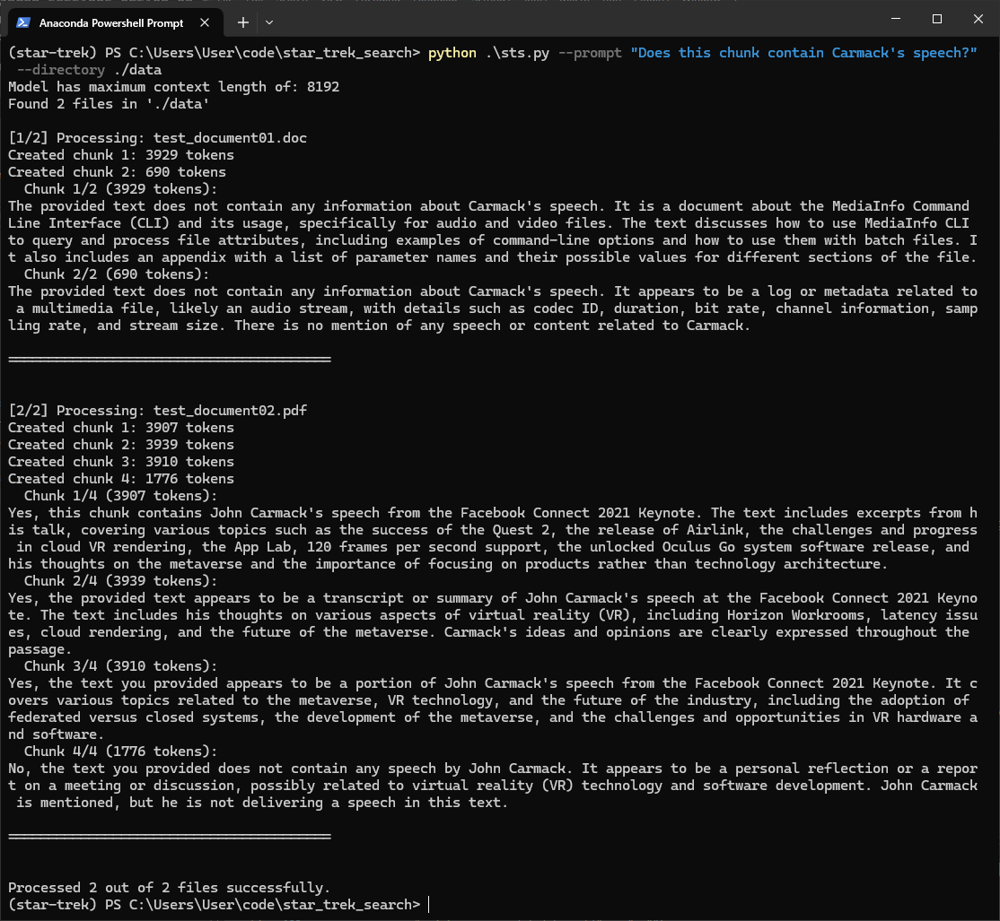

# Star Trek Style Search

Chunks each document in a directory and sends to an LLM for processing.



### Prerequisites

- Python 3.8+
- Folder with documents

### Installation

1. Clone this repository:
   ```bash
   git clone https://github.com/Opordhia/star-trek-search.git
   cd star-trek-search
   ```

2. Install dependencies:
   ```bash
   pip install -r requirements.txt
   ```

3. Download KoboldCpp:
	```bash
	curl -L -o koboldcpp https://github.com/LostRuins/koboldcpp/releases/latest/download/koboldcpp-linux-x64-cuda1210
	```
	
4. Run KoboldCpp:
    ```bash
	chmod +x ./koboldcpp
    koboldcpp --config cmdr.kcppt
	```
5. Open a new console and run:
    ```bash
	python3 sts.py  --prompt "Does this chunk contain a speech from Carmack?" --directory ./data
    ```	
